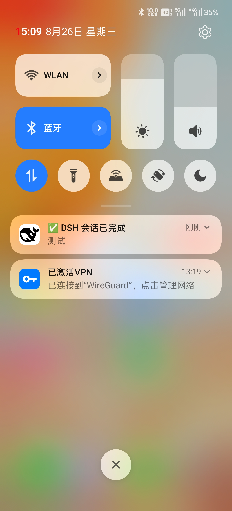
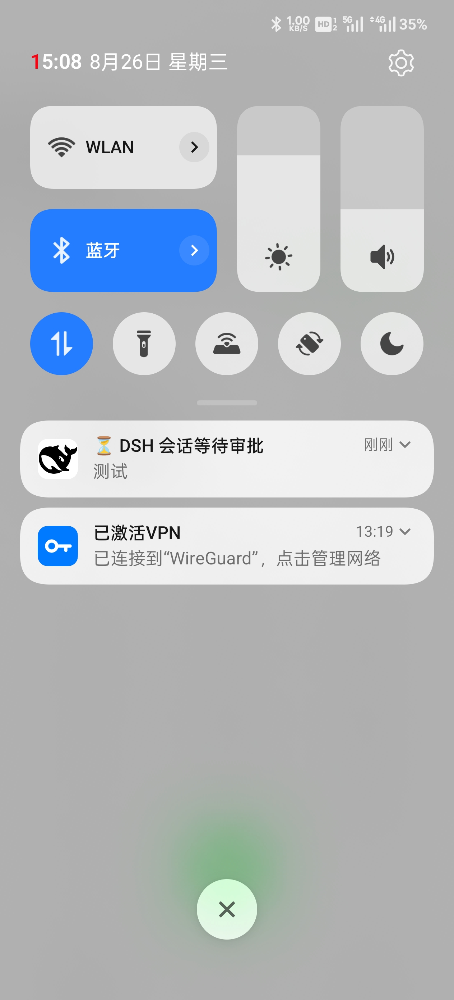

# DSH Remote · Notify

以**通知**为主题的 DSH（DeepSeek Harness）配套项目：

- **PC 端**：提供浏览器通知推送插件（npm 包 `@djmanito/dsh-notify`，本仓库根即该包），在关键节点上提供**审批、问答、会话完成**的触发推送通知——浏览器切至后台也能第一时间知道有待审批、待问答以及会话完成状态；
- **安卓端**：提供 Android App（`android/` 目录），手机连接到 DSH 的情况下也能接收同样的推送信息（**后台/锁屏可收**），主界面为 DSH 浏览器形态，可随时继续操作任务。

## 功能

### PC 端（@djmanito/dsh-notify 插件：浏览器通知推送）

- 浏览器系统通知（Windows/macOS）：
  - ⏳ DSH 会话等待审批 / ⏳ DSH 会话等待回答
  - ✅ 审批已通过 / ❌ 审批未通过 / ✅ 已收到回答
  - ✅ DSH 会话已完成
- 每类三态：**一直通知**（每次触发弹新通知+响铃）/ **静默通知**（仅首次弹+响，之后更新已有通知）/ **关闭通知**
- **完成审批自动撤回**：审批/问答通过后，自动撤掉之前的"等待"通知（可开关）
- DSH 设置页「**通知设置**」分区：总开关 / 三态 / 撤回 / **设置指导**（HTTP 入口下如何启用浏览器系统通知）

### 安卓端（App：DSH Remote · Notify）

- 原生通知与 PC 端**同语义**（⏳/✅/❌、三态、完成撤回），App 在**后台/锁屏**均可接收；App 前台可见时静默（避免重复打扰）
- **悬浮球**：贴边半圆，点一下直接打开设置页，可拖动
- **设置页**：连接设置（IPv4/IPv6/域名，「测试并保存」）、通知三态设置、系统通知/后台耗电一键跳转、监控日志独立页、轮询间隔、版本与免责
- 主界面 = DSH 浏览器形态（WebView 直连），与手机浏览器访问 DSH 同屏
- 安全区适配（排除状态栏/导航栏/品牌 bar）；后台可靠性：前台服务 6h 自动接力 WorkManager 周期兜底，打开 App 自动恢复

## 效果预览

**手机端**

| 会话完成 | 等待审批 |
|:---:|:---:|
|  |  |

**Windows 端**

| 等待审批 | 等待问答 | 会话结束 |
|:---:|:---:|:---:|
|  |  |  |

## 安装部署

### 前置条件

pnpm 在 PATH 中（`dsh plugin` 命令依赖）：`npm install -g pnpm`

### 安装插件

```bash
dsh plugin --profile web add github:DJmanito/dsh-notify
# 安装后需重启 DSH
```

### 删除插件

```bash
dsh plugin --profile web remove @djmanito/dsh-notify
# 删除后需重启 DSH
```

### 安装 App

GitHub Releases 下载 `DSH.Remote.Notify.apk` 安装；源码在 `android/` 目录可自行构建。

## ⚠️ 安全说明（重要）

- **强烈不建议将 DSH 端口暴露到广域网（WAN/互联网）**：DSH 的 Web 入口能力等同于"在 PC 上执行代码"，**连接地址本身即钥匙**；
- 明文 HTTP 仅限**局域网/可信内网**使用；外网访问请使用 WireGuard/Tailscale 等自建虚拟局域网，**不要**直接端口映射/公网暴露；
- App 对 DSH 只做只读轮询，不写入任何数据；
- 通知设置两端各自本地保存（手机 = App 私有存储；PC = 浏览器 localStorage），互不同步。

## 插件端点（调试）

| 端点 | 说明 |
|---|---|
| `GET /notify-state` | 状态快照（含 decisions 审批判定），手机 App 轮询源 |
| `GET /notify-test?mode=approval\|done\|question\|off` | 四态调试（仅内存，off 复原） |
| `GET /notify-smoke` | 注入脚本冒烟报告（Notification API 可用性） |
| `GET /notify-ops` | 通知操作日志（post/cancel，诊断用） |

## 工作原理

- App 后台服务（dataSync）按轮询间隔（默认 20s，5-60 可配）拉取插件的只读端点 `GET /notify-state`（状态快照，含审批通过/不通过判定）；
- 纯 JVM 状态机做**边沿触发 + 会话级去重**（基线帧静默，冷启动不重放），转 NotificationManager 推送；
- 插件侧秒级检测：运行中会话差集 = 完成（**子代理会话不计入**，其完成不触发通知；子代理的审批/问答照常通知）；事件流末尾审批请求未决 = 待审批；问答工具调用未应答 = 待回答。

## 免责

本软件仅供个人参考与学习，按“现状”提供，不作任何担保；使用本软件的风险由使用者自行承担，作者不对使用本软件引起的数据丢失、系统损坏或任何间接损失负责。**请勿将 DSH 暴露到广域网。**

## License

MIT（见 [LICENSE](LICENSE)）
