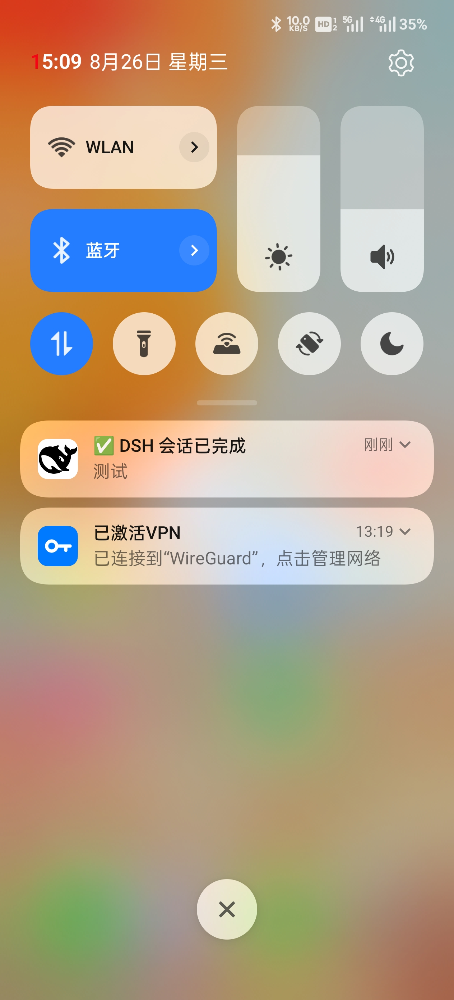
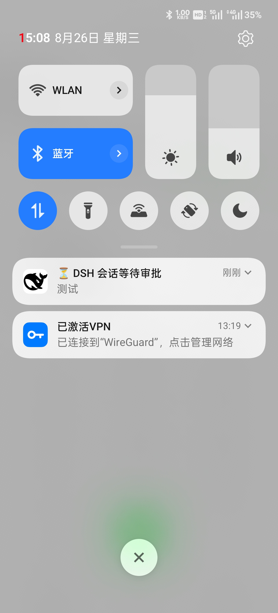

# DSH Remote · Notify

以**通知**为主题的 DSH（DeepSeek Harness）配套项目：

- **PC 端**：提供通知推送插件（npm 包 `@djmanito/dsh-notify`，本仓库根即该包），在关键节点上提供**审批、问答、会话完成**的触发推送通知——浏览器切至后台、DSH 桌面端在后台运行时，也能第一时间知道有待审批、待问答以及会话完成状态；
- **安卓端**：提供 Android App（`android/` 目录），手机连接到 DSH 的情况下也能接收同样的推送信息（**后台/锁屏可收**），主界面为 DSH 浏览器形态，可随时继续操作任务。

**环境兼容**：DSH 桌面端（最新 Electron 壳）、浏览器访问（最新/旧版 DSH Web 入口）三端全支持；手机 App 独立轮询，不受影响。

## 功能

### PC 端（@djmanito/dsh-notify 插件：桌面端 + 浏览器通知推送）

- 系统通知（Windows/macOS；DSH 桌面端与浏览器均生效，桌面端免授权弹窗）：
  - ⏳ DSH 会话等待审批 / ⏳ DSH 会话等待回答
  - ✅ 审批已通过 / ❌ 审批未通过 / ✅ 已收到回答
  - ✅ DSH 会话已完成
- **Windows 桌面端额外走 WinRT 直发通道**：插件后端在事件边沿直接调用 Windows 通知中心（`ToastNotificationManager`，AUMID `DJmanito.DshNotify`）——弥补 DSH 桌面壳 Electron 未设 `AppUserModelID` 导致渲染器 Notification 静默失效的问题（浏览器环境不受此影响，两端通道并存、互不干扰）。**该通道同样受「通知设置」管辖**（总开关 / 审批 / 任务完成三态）：注入脚本在设置变化时上报后端，后端只认桌面壳（Electron UA）的上报——WinRT 是宿主机本地通知，由本机桌面窗口的设置管理。
  - **AUMID 污染自愈**：若宿主应用（或其进程树）设置了"包标识"形态的 AppUserModelID，子进程会继承它，WinRT 将以 `0x80073D54（进程没有程序包标识符）`拒绝发通知。插件自动检测该错误码，改经 **WMI `Win32_Process.Create`**（进程由 WMI 服务创建、token 无继承标识）重发——两级尝试全程无感；任何一级失败仅记录到 `/notify-debug` 的 `lastToastError`，绝不影响 DSH 主流程
- **完成语义**：主代理结束**且其全部子代理也结束**才发"会话已完成"（主代理结束但子代理仍在跑 → 不通知）；子代理的审批/问答照常通知
- 每类三态：**一直通知**（每次触发弹新通知+响铃）/ **静默通知**（仅首次弹+响，之后更新已有通知）/ **关闭通知**
- **完成审批自动撤回**：审批/问答通过后，自动撤掉之前的"等待"通知（可开关）
- DSH 设置页「**通知设置**」分区（桌面端/浏览器均可用）：总开关 / 三态 / 撤回 / **设置指导**（HTTP 入口下如何启用浏览器系统通知）

### 安卓端（App：DSH Remote · Notify）

- 原生通知与 PC 端**同语义**（⏳/✅/❌、三态、完成撤回），App 在**后台/锁屏**均可接收；App 前台可见时静默（避免重复打扰）
- **悬浮球**：贴边半圆，点一下直接打开设置页，可拖动
- **设置页**：连接设置（IPv4/IPv6/域名，「测试并保存」）、通知三态设置、系统通知/后台耗电一键跳转、监控日志独立页、轮询间隔、版本与免责
- 主界面 = DSH 浏览器形态（WebView 直连），与手机浏览器访问 DSH 同屏
- 安全区适配（排除状态栏/导航栏/品牌 bar）；后台可靠性：前台服务 6h 自动接力 WorkManager 周期兜底，打开 App 自动恢复

## 效果预览

**手机端**

| 会话完成 | 等待审批 |
|:---:|:---:|
|  |  |

**Windows 端**

| 等待审批 | 等待问答 | 会话结束 |
|:---:|:---:|:---:|
|  |  |  |

## 安装部署

### 前置条件

pnpm 在 PATH 中（`dsh plugin` 命令依赖）：`npm install -g pnpm`

### 安装插件

```bash
# --profile 换成你的 DSH profile 名(桌面端 DSH 常见为 desktop;纯 Web 入口可为 web 等)
dsh plugin --profile desktop add github:DJmanito/dsh-notify
# 安装后需重启 DSH(桌面端 = 完全退出后重开)
```

> 桌面端与浏览器访问**共用同一个 DSH 后端**，插件装一次即两端生效：桌面窗口经启动注入行获得通知，浏览器/手机经同一 web 服务获得相同状态。

### 删除插件

```bash
dsh plugin --profile desktop remove @djmanito/dsh-notify
# 删除后需重启 DSH
```

### 安装 App

GitHub Releases 下载 `DSH.Remote.Notify.apk` 安装；源码在 `android/` 目录可自行构建。

## ⚠️ 安全说明（重要）

- **强烈不建议将 DSH 端口暴露到广域网（WAN/互联网）**：DSH 的 Web 入口能力等同于"在 PC 上执行代码"，**连接地址本身即钥匙**；
- 明文 HTTP 仅限**局域网/可信内网**使用；外网访问请使用 WireGuard/Tailscale 等自建虚拟局域网，**不要**直接端口映射/公网暴露；
- App 对 DSH 只做只读轮询，不写入任何数据；
- 通知设置两端各自本地保存（手机 = App 私有存储；PC = 浏览器 localStorage），互不同步。

## 插件端点（调试）

| 端点 | 说明 |
|---|---|
| `GET /notify-state` | 状态快照（含 decisions 审批判定），手机 App 轮询源 |
| `GET /notify-test?mode=approval\|done\|question\|off` | 四态调试（仅内存，off 复原） |
| `GET /notify-test-toast` | 手动触发一条 WinRT 审批 toast（验证 spawn 链；结果看 `/notify-debug`） |
| `GET /notify-smoke` | 注入脚本冒烟报告（Notification API 可用性） |
| `GET /notify-ops` | 通知操作日志（post/cancel/win-toast，诊断用） |
| `GET /notify-debug` | 运行时诊断（轮询计数、心跳、会话/代理计数、toast 计数、生效设置） |
| `POST /notify-settings` | 设置同步（注入脚本上报；仅桌面壳 UA 生效，管理 WinRT 通道） |

## 工作原理

- App 后台服务（dataSync）按轮询间隔（默认 20s，5-60 可配）拉取插件的只读端点 `GET /notify-state`（状态快照，含审批通过/不通过判定）；
- 纯 JVM 状态机做**边沿触发 + 会话级去重**（基线帧静默，冷启动不重放），转 NotificationManager 推送；
- 插件侧秒级检测：
  - **运行中集合**：主会话的 agent 运行中 → 计入；**子代理运行中 → 归属到其顶层主会话**（沿 `parentSession` 谱系向上归并，`delegationDepth=1` 时父会话离线也能归属）。因此**主代理结束但子代理仍在跑 → 主会话仍在运行集合中 → 不发完成通知**；主代理与全部子代理都结束 → 集合清空 → 边沿触发"会话已完成"。
  - 子代理会话自身从不直接计入运行集合（其单独完成不触发通知）；对话 fork 视为顶层会话，完成照常通知；
  - 事件流末尾审批请求未决 = 待审批；问答工具调用未应答 = 待回答；**子代理的审批/问答照常通知**（那是真正中断进度的事件）。
- 检测与推送同源于 `/notify-state`，因此 PC 桌面端、浏览器、手机 App 三端**完成语义完全一致**。

## 环境兼容

| 环境 | 页面注入通道 | 说明 |
|---|---|---|
| **DSH 桌面端**（最新 Electron 壳） | `webserver/index-inject` 结构化 script 行 + **WinRT 直发** | 桌面壳静态服务 index.html 并经启动 IPC 携带注入行，页面端解释执行；桌面端对 Notification 权限自动放行，免授权弹窗。**另**：插件后端在事件边沿直接调用 Windows 通知中心（WinRT `ToastNotificationManager`），弥补桌面壳 Electron 未设 `AppUserModelID` 导致渲染器 Notification 静默失效的问题 |
| **浏览器访问**（最新 DSH Web 入口） | 结构化行 + `tapIndex` 双通道 | 服务端 `renderIndex` 把行渲染进 index.html；`tapIndex` 原始转换并存，注入脚本内置幂等守卫（`window.__dshRemoteNotifyInjected`），重复注入无副作用 |
| **旧版 DSH**（仅浏览器 Web 入口） | `tapIndex` 原始转换 | 旧版无 `webserver/index-inject` 事件，订阅静默无效、自动回落；事件流读取回落 `session.events`，标题读取兼容 `{title}` 旧形态 |

> 手机端 App 不依赖页面注入（独立轮询 `/notify-state`），新旧环境均不受影响。

## 免责

本软件仅供个人参考与学习，按“现状”提供，不作任何担保；使用本软件的风险由使用者自行承担，作者不对使用本软件引起的数据丢失、系统损坏或任何间接损失负责。**请勿将 DSH 暴露到广域网。**

## License

MIT（见 [LICENSE](LICENSE)）
